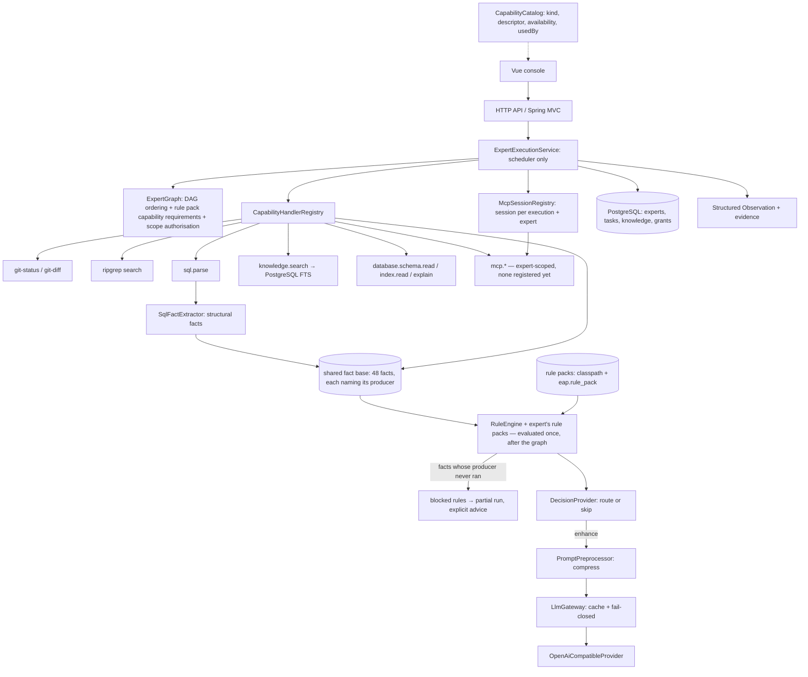
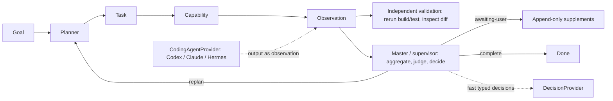

# Architecture

The platform is a cross-platform engineering console: a Vue frontend, a Java runtime, and optional
Python tooling. Its defining decision is **deterministic-first, model-last** — see
[pipeline.md](pipeline.md) for the value chain this architecture exists to serve.

This document describes **what is implemented today** and, separately, **what is planned**. Earlier
revisions of this file mixed both, which made it impossible to tell what actually runs. That mistake
is fixed here.

## Module boundaries

```text
frontend/            Vue 3 + TypeScript monorepo (Vite+ / pnpm)
  apps/web           browser console (product UI)
  packages/ui        shared presentational components
  packages/expert-sdk typed expert authoring DSL (compile-to-manifest, tooling only)
backend/             Java 25 / Spring Boot / Maven reactor
  eap-api            stable contracts only: Capability, ExecutionContext, Observation, ProcessExecutor,
                     and the expert analysis model
  eap-runtime        Spring Boot app: capability handler registry and catalog (kind, scope, descriptor,
                     availability, management entry point), process execution, HTTP API, declarative
                     rule engine and rule packs with capability requirements, expert orchestration,
                     knowledge retrieval, LLM preprocessing gateway, decision layer
  eap-runtime/src/main/resources/db/migration
                     Flyway migrations (V1..V9)
docs/                architecture, pipeline, roadmap, environment, expert/knowledge/rules, prototype
```

`eap-api` contains no Spring and no LLM SDK. `eap-runtime` depends on `eap-api`.

## What is implemented today



**Deterministic capabilities.** Git status/diff and ripgrep search run through `ProcessExecutor`
(argument arrays, no shell interpolation). Each capability is a `CapabilityHandler` bean registered by
name; the executor no longer contains any per-capability logic.

**Capabilities are typed, self-describing, and each kind is manageable.** Every handler declares *what
kind of thing it is* (`command` / `cli` / `mcp` / `http`), *who may turn it on* (`platform` / `expert`),
a descriptor (title, summary, inputs, grants, executor, the facts it publishes, the evidence it
contributes) and whether it is runnable right now (`available` / `missing-binary` / `not-configured` /
`disabled`, probed for `cli` by a pure `PATH` lookup). `CapabilityCatalog` serves this at
`/api/capabilities`, grouped by kind, reconciled against the declared vocabulary and annotated with
which experts use each capability — so the console renders facts about the runtime rather than a
hard-coded list. A read-only catalog is only half a catalog, so each kind also declares **where an
operator can change it** (`CapabilityManagement`): `command` capabilities can be switched on/off with a
note, `cli` capabilities additionally take a binary override (applied live) and an explicit probe, and
`mcp` servers have a full registration surface. Creating a capability is deliberately not among these
operations — it needs a handler bean and a declaration, and the console says so rather than offering a
button that cannot work. See [expert-knowledge-rules.md](expert-knowledge-rules.md) §3.

**One switch per capability, absent means enabled, and disabled is not missing.** `eap.capability_setting`
is opt-out (an unreadable table yields a working platform), switching off a capability an *enabled*
expert runs is refused with the expert names that still use it, and a disabled capability is reported as
`disabled` — never as `missing-binary` / `not-configured`, because "switched off" is a decision and
"broken" is a defect. A manifest referencing a disabled capability is rejected with *…已在平台停用…请
在能力目录中重新启用*, and `CapabilityHandlerRegistry.resolveFor` refuses it at run time too, so a stale
grant cannot smuggle it back in.

**Expert-scoped capabilities are never globally enabled.** MCP tools and remote endpoints carry an
external session and a per-expert trust decision, so they are not registered "for everyone": an
operator registers the server through `/api/mcp-servers` (disabled and untrusted by default, with a tool
allow-list, `id` validated against the `mcp.<server>.<tool>` segment shape at the source), the expert
declares the tool in `mcpTools`, activation writes the grant into `eap.expert_mcp_grant`, the graph
validator rejects a node whose tool was not declared, and the run-time lookup
(`CapabilityHandlerRegistry.resolveFor`) refuses an undeclared tool even though the handler exists. Each
call runs in a session owned by one `(execution, expert, server)` triple (`McpCallScope` +
`McpSessionRegistry`) which is closed when the execution ends, so two experts can never share a
server's session state. See [expert-knowledge-rules.md](expert-knowledge-rules.md) §3.

**Declarative rules.** `SqlFactExtractor` parses SQL with JSQLParser and emits a flat map of structural
facts — it contains no domain judgement. `RuleEngine` interprets the expert's rule packs over those
facts and produces findings, severity counts, complexity and a confidence. The packs themselves are
JSON (`rules/*.json` shipped, `eap.rule_pack` authored) with a measured confidence policy, so checks,
severities, wording and escalation thresholds are all editable without a rebuild.

**Facts name their producer, and packs declare what they need.** Every fact in `SqlFactVocabulary`
carries `producedBy`, so the capabilities a pack requires are *derivable* from the facts its rules
reference; `requires.capabilities` is validated against that derived set, and `ExpertGraph` refuses an
expert that references a pack without the nodes producing those facts. At run time the judgement stage
executes once over the accumulated fact base (after the whole graph), and any rule whose producers did
not run is reported as a **blocked** rule — the run degrades to `partial` with explicit advice instead
of reporting "no findings". See [expert-knowledge-rules.md](expert-knowledge-rules.md) §2–§3.

**Expert orchestration.** An expert is a declarative JSON manifest (`eap/v1`) with steps, explicit
edges, rule pack references and platform invariants. `ExpertGraph` validates the DAG (single entry, no
cycles, known capabilities, satisfiable rule pack requirements) and orders it. `ExpertExecutionService`
resolves the declared rule packs, runs nodes in dependency order, blocks dependents of a failed required
node, enforces knowledge and database grants, redacts evidence and persists observations. Shipped
experts are seeded into `expert_definition` with `builtin = true` by `BuiltinResourceSeeder`, so
built-in and operator-authored experts share one code path.

**Knowledge.** `knowledge.search` performs PostgreSQL full-text search plus local keyword matching
(including Chinese bigram segmentation). Access is deny-by-default via `expert_knowledge_grant`.
There is **no** vector retrieval in the current implementation.

**Database snapshots.** `database.schema.read` / `database.index.read` read a human-registered,
redacted metadata snapshot from `eap.database_profile`. The runtime never connects to a business
database and never executes user SQL.

**Model gateway.** `LlmGateway` + `OpenAiCompatibleProvider` + `PromptPreprocessor` +
`DecisionProvider` implement stages 3–5 of the pipeline. The model is off by default.

**Persistence.** PostgreSQL schema `eap`, managed by Flyway (V1–V9). An adoption path exists for a
pre-existing hand-built schema (`EAP_ADOPT_EXISTING_SCHEMA=true`), see
[runtime-workflow.md](runtime-workflow.md).

## What is planned (not yet implemented)

These are target designs, not current behaviour. Each is gated behind a roadmap phase with exit
criteria in [roadmap.md](roadmap.md).



- **Independent validator.** Reads the VCS diff independently of any agent claim, rebuilds and reruns
  tests before a task may be marked `completed`.
- **Master / supervisor.** A platform-owned decision layer that aggregates evidence, maps it to
  acceptance criteria, and owns the task state machine (`planned → running → expert-review →
  validating → completed | replanning | awaiting-user | escalated`).
- **User supplements.** Append-only task events that create a new plan revision without erasing
  prior evidence.
- **CodingAgentProvider.** Adapters that call an external coding agent, whose output is treated as an
  unverified observation and revalidated.
- **Multi-expert routing.** Selecting an expert from a goal; today the caller names one explicitly.
- **Desktop shell.** Tauri 2 wrapping the same Vue app behind a `DesktopPlatform` contract —
  [desktop-spec.md](desktop-spec.md).

## Technology decisions

- **Backend:** Java 25, Spring Boot 4.1, Maven, Spring MVC, JDBC (`JdbcTemplate`), Flyway, JUnit 5.
  Single local process; Docker/Kubernetes/Spring Cloud are out of scope.
- **SQL parsing:** JSQLParser 5.4. Parsing is local and deterministic.
- **Model integration:** OpenAI-compatible HTTP only, behind `LlmProvider`. No provider SDK in
  `eap-api`.
- **Frontend:** Vue 3, TypeScript, Vite+, pnpm workspace, Tailwind CSS 4 via the Vite plugin.
- **Database:** PostgreSQL. Vector search is *not* part of the current phase (see
  [environment.md](environment.md)).

## Non-negotiable invariants

- Capability commands are argument arrays, never shell-interpolated strings.
- Every execution returns a structured observation with exit code and captured output.
- External agent output is observation, not truth.
- The validator reads the repository independently of an executor's claims.
- Scope, authorisation, and changed files are visible before completion.
- Expert, knowledge-base and rule definitions are validated before use.
- **Domain judgement is configuration.** A check, its severity, its wording and its escalation
  threshold belong in a rule pack; adding one must not require a code change.
- **Code only extracts facts.** Capability dispatch goes through the handler registry; neither the
  executor nor any service branches on a specific expert id.
- **Every fact names the capability that produces it, and every rule pack declares the capabilities it
  needs.** The declaration is validated against the facts the rules reference, and an expert that
  references a pack without the nodes that produce those facts is rejected at save/enable time
  (`ExpertGraph.validate`). A requirement that is unmet at run time is reported as a *blocked* rule —
  never as "no findings".
- **A capability declares its kind, its scope, its description and its availability.** The console
  renders the catalog the runtime reports; it never infers capability metadata or invents capability
  groups.
- **Every kind of capability has a management entry point, and its existence is still code.** Each kind
  declares what an operator may change (enable/disable, binary override for `cli`, server registration
  for `mcp`) and refuses the rest — creating a capability requires a handler bean plus a declaration, and
  the console states that instead of hiding it. A capability switched off is reported as `disabled`, not
  as missing, and is refused both at manifest validation and at run time.
- **An expert-scoped capability (MCP tool, remote endpoint) is never globally enabled.** It is
  registered with the platform, declared by the expert, granted on activation, resolved per expert and
  called in a session owned by one execution — never in a session shared between experts.
- Knowledge access is deny-by-default and every retrieved source is cited.
- Rules are evaluated by the platform; experts cannot self-certify compliance.
- A model is consulted only after deterministic evidence and only with a compressed, bounded prompt.
