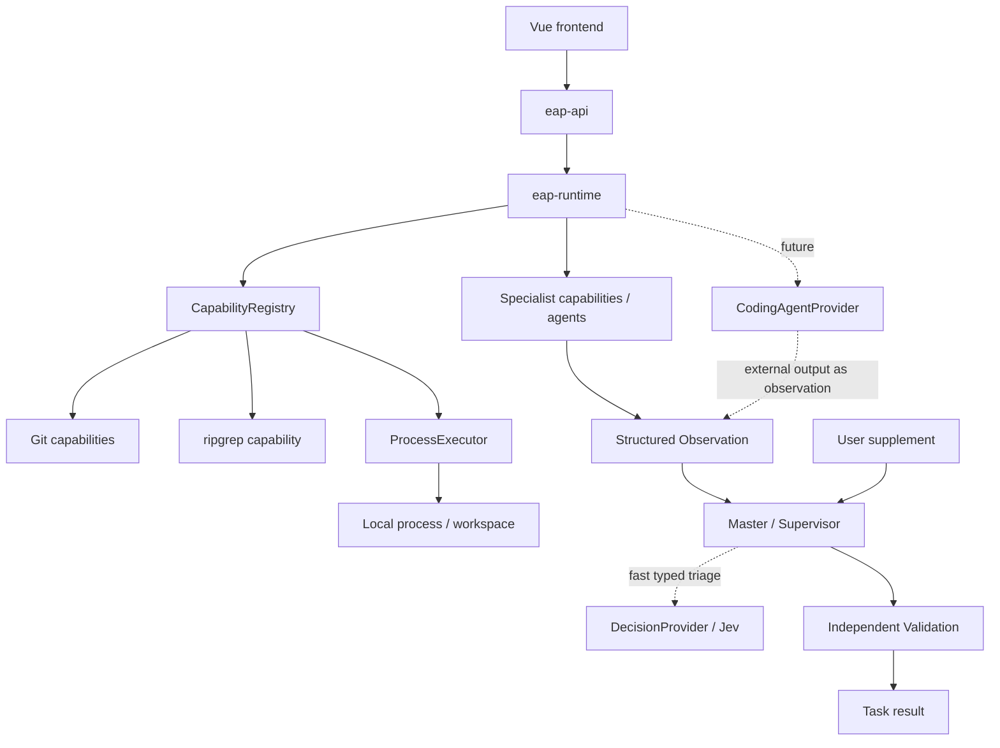
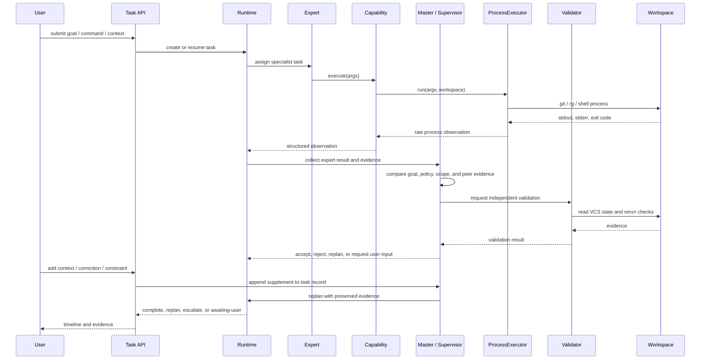
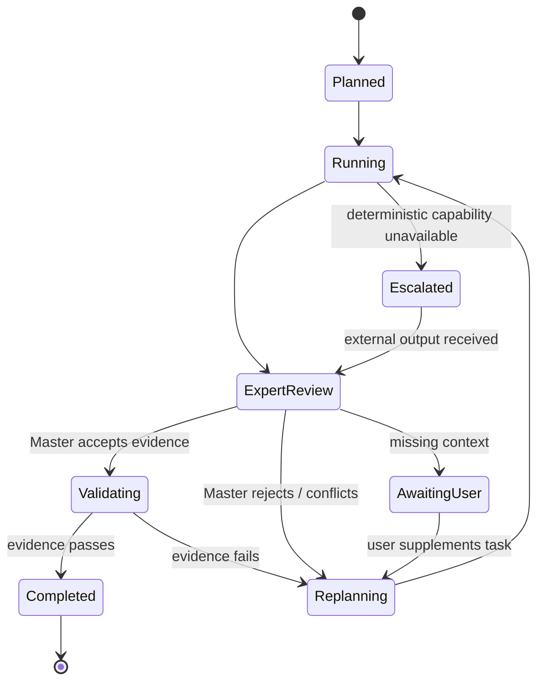

# Backend architecture and flow

## Module boundaries



`eap-api` contains stable contracts only: `Capability`, `ExecutionContext`, `Observation`, and `ProcessExecutor`. `eap-runtime` contains local execution, capability registration, CLI/API adapters, and later supervisor logic. No LLM SDK belongs in the API module.

## Deterministic execution flow



## State machine



## Master / Supervisor

The Master is a platform-owned decision layer, not another expert. It aggregates specialist observations and user supplements, then decides the next transition. It must map results to acceptance criteria, detect conflicts or out-of-scope changes, require independent validation evidence, preserve prior observations, and pause at `awaiting-user` when a safe decision cannot be inferred.

An expert may propose `done`; only the Master can emit `completed`, and only after the Validator supplies sufficient evidence.

### Optional fast decision layer

The Master may use a `DecisionProvider` such as Jev for small, typed decisions: classify task complexity, select an expert, rank retrieved evidence, decide whether a tool call needs review, or triage a validation result. Jev returns a choice, score, or probability rather than generated code, so it is a good latency/cost optimization for routing and judgment. It is not authoritative: deterministic rules and independent validation remain the final gate.

```text
Observation / candidates
        ↓
DecisionProvider (Jev or local rules)
        ↓
route / rank / confidence / needs-review
        ↓
Master policy
        ↓
Expert, Validator, Replan, or Escalate
```

Integration boundary:

```java
public interface DecisionProvider {
  Decision decide(DecisionRequest request);
}
```

The provider must be optional and fail closed. A timeout, low confidence, schema failure, or provider outage routes back to deterministic rules or asks the Master for a slower review. Never let a Jev decision bypass permission checks, blocking rules, diff inspection, build/test validation, or user authorization.

## User supplements

User additions are append-only task events. They do not erase the submitted goal or prior evidence:

```text
Task
├─ Goal v1
├─ Plan v1
├─ Expert observations
├─ Master decision: awaiting-user
├─ UserSupplement { text, constraints, attachments, author, timestamp }
└─ Plan v2 -> reuses valid evidence, invalidates affected conclusions
```

The API should expose `POST /tasks/{id}/supplements`; the response creates a new plan revision and reports which prior observations remain valid.

## Development phases

| Phase | Scope | Exit evidence |
|---|---|---|
| 1 | Capability SPI, process execution, Git status/diff, ripgrep, CLI | Unit tests and deterministic CLI output |
| 2 | Workspace safety and independent validation | Diff/build/test validator rejects false completion |
| 3 | HTTP API and task state model | Typed API can drive the same runtime as CLI |
| 4 | Frontend task timeline and evidence inspector | UI renders live observations and validation state |
| 5 | Planner, supervisor, replan, escalation | State machine tests cover complete/fail/escalate paths |
| 6 | CodingAgentProvider adapters | Provider output is revalidated before completion |

## Non-negotiable invariants

- Capability commands are argument arrays, not shell-interpolated strings.
- Every execution returns a structured observation with exit code and captured output.
- The validator reads the repository independently of the executor's claims.
- External agent output is observation, not truth.
- Scope, authorization, and changed files are visible before completion.
- Expert, knowledge-base, and rule definitions are versioned and validated before use.
- Knowledge access is deny-by-default and every retrieved source is cited.
- Rules are evaluated by the platform; experts cannot self-certify compliance.
