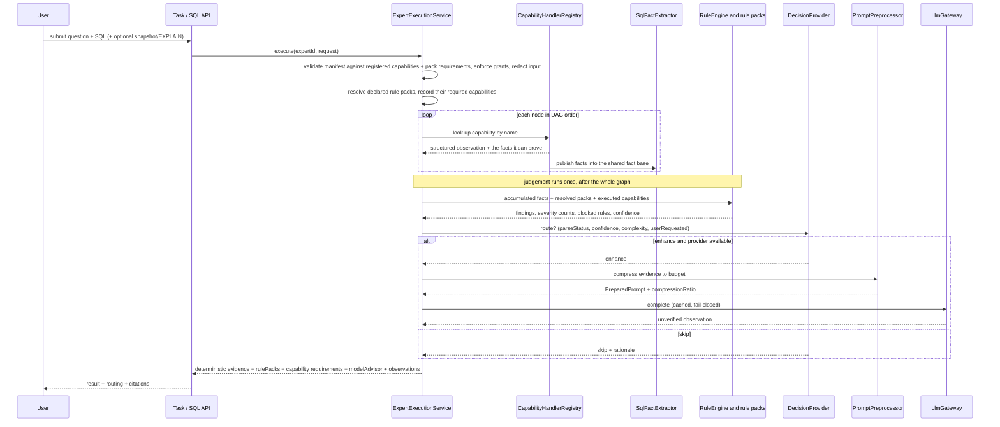
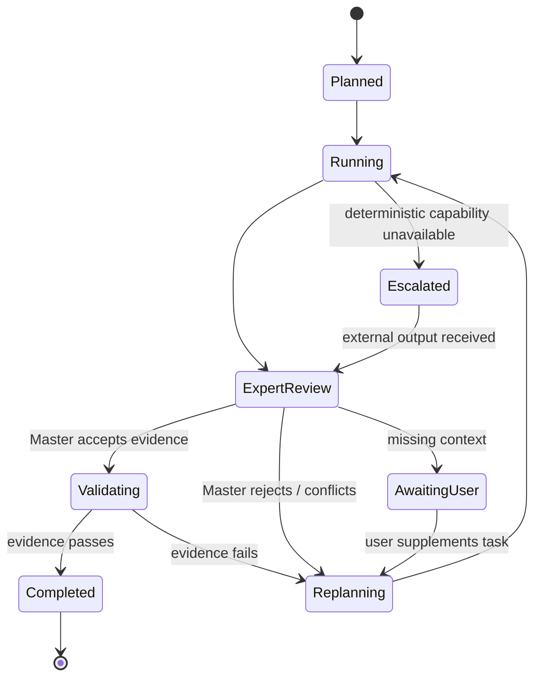

# Backend runtime reference

For the module boundaries and what is implemented today, read [architecture.md](architecture.md).
This file is the runtime *reference*: the HTTP surface, the execution flow, and the target state
machine.

## HTTP API

| Method | Path | Purpose |
|---|---|---|
| GET | `/api/health` | Liveness and runtime status. |
| GET | `/api/capabilities` | Capability catalog: every declared + registered capability with its kind, **scope**, **management entry point**, **enabled/disabled**, metadata, availability, facts, MCP servers and which experts reference it. |
| PUT | `/api/capabilities/{name}/activation` | Switch a whole capability **kind** on or off platform-wide (`{enabled, notes}`); refused while an enabled expert runs it. |
| PUT | `/api/capabilities/{name}/cli` | Override the **binary** a `cli` capability runs (`{binary}`); applied live, no restart. |
| POST | `/api/capabilities/{name}/cli/probe` | Explicitly run `<binary> --version` for the CLI capability — the only place a binary is executed for a management question. |
| GET | `/api/mcp-servers` | Registered MCP servers (`id`, transport, endpoint, allow-listed tools, trusted, enabled, problems). |
| POST | `/api/mcp-servers` | Register a server (`id` validated against the `mcp.<server>.<tool>` segment shape; credentials in the endpoint refused). |
| PUT | `/api/mcp-servers/{id}` | Edit a server's name, transport, endpoint or tool allow-list. |
| PUT | `/api/mcp-servers/{id}/activation` | Enable/trust a server independently of the expert grants that reference its tools. |
| POST | `/api/mcp-servers/{id}/probe` | Probe reachability; reports `verified: false` because there is no protocol client yet. |
| DELETE | `/api/mcp-servers/{id}` | Delete a server; refused while an enabled expert still holds a grant on one of its tools. |
| GET | `/api/experts` | Expert definitions plus enabled/builtin/revision state. |
| GET | `/api/experts/catalog` | Platform capability items and kind summaries, platform rules, rule pack summaries (with `requires`), the fact vocabulary (with `producedBy`), the expert-scoped vocabulary and the registered MCP servers. |
| POST | `/api/experts/validate` | Server-side validation of a manifest: graph, capability vocabulary, **expert-scope authorisation (`mcpTools`)**, knowledge/database references, platform rules, rule packs **and the capabilities those packs need**. |
| POST | `/api/experts` | Save a **disabled** draft. |
| PUT | `/api/experts/{id}/activation` | Explicitly enable/authorise or disable/revoke — writes and revokes the knowledge, database **and MCP tool** grants. |
| POST | `/api/experts/{id}/execute` | Execute the DAG and persist observations. |
| GET | `/api/rule-packs` | Rule pack catalog (shipped + authored) with rule counts, state, `requires` and derived required facts. |
| GET | `/api/rule-packs/vocabulary` | Fact and operator vocabulary a rule may reference, including each fact's producing capability. |
| GET | `/api/rule-packs/{id}` | Full pack JSON plus `shipped`/`editable` flags and its capability requirements. |
| POST | `/api/rule-packs` | Create or overwrite an authored pack (validated first). |
| PUT | `/api/rule-packs/{id}` | Update an authored pack. |
| PUT | `/api/rule-packs/{id}/activation` | Enable or disable an authored pack without deleting it. |
| DELETE | `/api/rule-packs/{id}` | Delete an authored pack; refused while an enabled expert references it. |
| POST | `/api/rule-packs/validate` | Validate a pack without saving, including its `requires.capabilities` declaration. |
| POST | `/api/rule-packs/dry-run` | Evaluate a candidate pack against a SQL statement; returns facts, findings, declared/derived requirements, fact producers and blocked rules. |
| POST | `/api/sql/analyze` | Run the SQL expert through the same executor (a custom `expertId` must be enabled). |
| GET | `/api/tasks` / `/api/tasks/{id}` | Task list / full evidence. |
| GET/POST/PUT/DELETE | `/api/databases`, `/api/databases/{id}` | Maintain redacted database metadata snapshots. Deletion is refused with `409` while an **enabled** expert still declares the profile — a draft reference grants nothing and does not block. |
| GET/POST/PUT/DELETE | `/api/knowledge`, `/api/knowledge/{id}`, `/api/knowledge/{id}/documents`, `/api/knowledge/search` | Knowledge base management and retrieval. |

The server binds to loopback and assumes a trusted local operator. **Do not expose these endpoints**
until an authentication and authorisation layer exists.

### Capability catalog

`GET /api/capabilities` used to return a flat list of names, which hid the only two things an operator
needs to know: what has to exist outside the platform, and whether it is runnable here. Each handler now
declares all of it (`CapabilityHandler.kind()` / `scope()` / `describe()` / `availability()`):

- **`kind`** — `command` (in-process, no external dependency), `cli` (a local binary via
  `ProcessExecutor`, argument arrays only), `mcp` (a tool published by a trusted MCP server, whose
  output is an unverified observation) or `http` (an allow-listed remote endpoint). Today the runtime
  registers 5 `command` and 3 `cli` capabilities and no `mcp`/`http` ones.
- **`scope`** — `platform` (registered once, any expert may run it) or `expert` (never globally
  enabled; see below). `kind` supplies the default: `mcp` and `http` are expert-scoped.
- **descriptor** — `title`, `summary`, `inputs`, `grants`, `executor`, `facts` it publishes, `evidence`
  it contributes, `readOnly`, and (for `cli`) the `binary` it resolves.
- **`availability`** — `available` / `missing-binary` / `not-configured` / **`disabled`**. A `cli`
  capability whose binary is absent is probed on `PATH` via `LocalBinaries` (no subprocess is executed)
  and reported as `missing-binary` instead of appearing healthy. `disabled` is deliberately a separate
  state: *switched off* is a decision, not a missing prerequisite, and the console must not present it
  as "broken".
- **`management`** — where an operator can actually change this kind of capability (see below). Each
  catalog item carries `management`, `enabled`, `notes` and, for `cli`, a `cli` block
  (`binary`, `source` = `shipped`/`operator`, `resolvedPath`, `availability`).

The response also reconciles three lists — `declared` (manifest vocabulary), `unregistered` (declared
without a handler) and `undeclared` (a handler nobody declared) — and annotates every item with
`scope`, `expertScoped`, `globallyRunnable`, `authorisedExperts` (from `eap.expert_mcp_grant`) and
`usedBy` / `declaredBy`, read from `expert_definition`. A test asserts the declared vocabulary and the
registered handlers are identical, and that each handler's declared `facts` match what it publishes.

The catalog also reports `disabledPlatform` (capabilities switched off here) so that their absence from
the expert picker is explainable rather than mysterious, and per-kind `availability` counts so the
console can show, e.g., "3 个本地 CLI，其中 1 个缺少二进制".

### Every kind of capability has a management entry point

A read-only catalog is only half a catalog. Each `kind` declares, in `CapabilityManagement`, what an
operator may change — and, just as importantly, what they may not:

| Kind | Entry point | What can be changed | What stays code |
|---|---|---|---|
| `command` | `SETTINGS` | Enable/disable, note | The handler itself: a capability is a `@Component CapabilityHandler` plus one declaration in `ExpertGraph.CAPABILITIES`. A test asserts the two are identical. |
| `cli` | `CLI_CHANNEL` | Enable/disable, note, binary override, explicit probe | The command and argument array, and the facts it publishes. |
| `mcp` | `SERVER_REGISTRY` | Register/edit/enable/trust/allow-list/delete servers, probe | The client that would speak the protocol. |
| `http` | `NONE` | Nothing yet | The endpoint, its allow-list and its response mapping. |

Three properties make the switch honest:

- **Absent means enabled.** `eap.capability_setting` (`CapabilitySettings`) is opt-out, unlike the
  fail-closed trust tables. An unreadable settings table yields a working platform, not a dead one.
- **Refused while in use.** Switching off a capability an *enabled* expert runs is rejected with the
  expert names that still use it. A capability referenced only by *drafts* may be switched off — a
  draft is not yet part of the platform.
- **Disabled is not missing.** `ExpertGraph.validateCapabilitySwitches` rejects a manifest referencing a
  disabled capability with *能力 X 已在平台停用…请在能力目录中重新启用*, never as "未实现的能力". At run
  time `CapabilityHandlerRegistry.resolveFor` also refuses it, so a stale enablement cannot smuggle a
  disabled capability back in.

A `cli` override is **live**: the handler holds a `Supplier<String>` resolved per execution, so moving a
binary does not need a restart. Nothing is executed while the page renders — the resolved path comes
from `LocalBinaries.resolve`, which only probes `PATH`. Running the binary happens only when the
operator presses 探测, and then only as `<binary> --version` with a short timeout and redacted,
truncated output.

Creation is not among the operations for any kind. `CapabilityManagementController.requireRegistered`
returns a 404 explaining that a new capability needs a `CapabilityHandler` bean and a declaration in
`ExpertGraph.CAPABILITIES` — the console says the same thing on the overview page, so the code contract
is stated where an operator would look for a "new capability" button.

### MCP tools are expert-scoped, not platform capabilities

Registering an MCP tool globally would hand a session-bearing external service to every expert: two
experts calling it would share the session id, cursors and authenticated identity of whichever
connection existed, which mixes their state, their grants and their audit trail. The runtime therefore
refuses to let an MCP tool be a platform capability.

| Layer | Table / class | Behaviour |
|---|---|---|
| Platform registration | `eap.mcp_server` (`McpServerRegistry`, `McpServerService`) | Disabled and untrusted by default, with a tool allow-list. Only a server that is **enabled and trusted** publishes anything; an unreadable registry yields zero tools rather than "allow all". Managed through `/api/mcp-servers`. |
| Capability id | `mcp.<server>.<tool>` | Namespaced by server, so two servers may publish the same tool name without collision. The server id and tool names are validated **at the source** against the same segment shape `ExpertGraph` requires, so a typo cannot create a capability id no expert could ever reference. |
| Expert authorisation | `expert_manifest.mcpTools` → `eap.expert_mcp_grant` on activation | A node using an undeclared tool is rejected at save/enable time; disabling the expert revokes the grant like the knowledge and database grants. |
| Run-time resolution | `CapabilityHandlerRegistry.resolveFor` | Returns the handler only for an expert that declared the capability; otherwise the node fails with "专家级能力未在本专家清单中授权". |
| Session isolation | `McpCallScope`, `McpSessionRegistry` | One session per `(execution, expert, server)`; refused outside an open execution or for another expert; closed in the executor's `finally`, including on failure. |

Registration is where an MCP server enters the platform, so it is also where the dangerous inputs are
refused: an id that is not a valid capability segment, a tool name that is not, an unknown transport
(only `stdio` / `http` / `sse`) or an endpoint that carries credentials. Trust and enablement are
separate from the expert grants — a server can be registered, trusted and still referenced by no expert,
and deleting it is refused while an *enabled* expert holds a grant on one of its tools.

There is no MCP client yet, so a fresh install registers nothing here and the catalog reports zero `mcp`
capabilities (`mcpServers: []`). The registration surface exists anyway, because it is the entry point
that makes the `mcp` page non-empty; the probe is honest about the gap and reports `verified: false`.
The contract is in place so that adding a client cannot make MCP globally reachable by accident.

### SQL analysis response

`POST /api/sql/analyze` returns, among other fields:

```jsonc
{
  "status": "completed",              // completed | partial | failed
  "decision": "accepted",             // accepted | needs-review | rejected
  "advice": ["…"],                    // deterministic suggestions
  "rulePacks": [ {"id":"sql-antipatterns","name":"SQL 结构反模式规则包","ruleCount":21,
                  "requires":["sql.parse"]} ],
  "executedCapabilities": ["sql.parse","database.index.read"],   // capabilities that actually ran
  "rulePackRequirements": [ {"id":"sql-snapshot-evidence",
                             "required":["sql.parse","database.explain","database.schema.read","database.index.read"],
                             "met":false, "missing":["database.explain","database.schema.read"]} ],
  "deterministicAnalysis": {
    "parseStatus": "valid",
    "engineVersion": "sql-analyzer/4",
    "findings": [ {"code":"predicate.like.leading_wildcard","title":"LIKE 前导通配符","category":"谓词",
                   "severity":"high","evidence":"LIKE 模式以前导通配符 % 开头。",
                   "suggestion":"…","confidence":0.75} ],
    "rulesFired": ["…"],
    "blockedRules": [ {"rule":"plan.seq_scan", "missingFacts":["plan.seqScan"],
                       "missingCapabilities":["database.explain"]} ],
    "ruleCapabilities": [ {"id":"sql-antipatterns","required":["sql.parse"],"met":true,"missing":[]} ],
    "facts": { "select.allColumns": true, "join.count": 2, "table.list": "orders、customer" },
    "severityCounts": {"high":1},
    "complexity": 5,
    "deterministicConfidence": 0.85,
    "requiresModelReview": false,
    "summary": "触发 1 条规则（{high=1}）；确定性证据已足以给出可执行建议。"
  },
  "knowledgeEvidence": [ {"knowledgeBase":"…","source":"…","excerpt":"…"} ],
  "nodes": [ {"id":"parse","label":"解析 SQL 并执行规则包","capability":"sql.parse","state":"succeeded"} ],
  "expertAdvice": null,               // model text, unverified, or null
  "modelAdvisor": {                   // always present: why a model was or was not called
    "attempted": false, "succeeded": false,
    "decision": "skip", "rationale": "确定性证据已足以…",
    "preprocessing": {"estimatedTokens":420,"baselineTokens":2600,"compressionRatio":0.84}
  },
  "analysisMode": "deterministic-workflow",
  "modelEnhancement": "skipped"       // unavailable | skipped | unverified-observation
}
```

`facts` is returned on purpose: the console shows which facts matched, which is what makes a rule
pack's behaviour explainable rather than mysterious.

### Capability requirements in the response

Three keys exist because a rule pack is only as good as the nodes that can feed it:

| Key | Meaning |
|---|---|
| `executedCapabilities` | The capability ids that actually ran and published in this run. |
| `rulePackRequirements` | Per referenced pack: `required`, `met`, `missing`. Derived from the pack's `requires.capabilities` or from the facts its rules read. |
| `deterministicAnalysis.blockedRules` | Rules that could **not be judged** because a producing capability did not run, with `missingFacts` and `missingCapabilities`. |

A blocked rule is never rendered as "no problem found": it adds an explicit advice line, forces
`status` to `partial` / `decision` to `needs-review`, and appends `…；另有 N 条规则因所需能力未执行而未能判定，结果不完整。`
to the summary. Validation, by contrast, refuses the mismatch earlier — an expert that references a
pack without the nodes that produce its facts cannot be saved or enabled (see
[expert-knowledge-rules.md](expert-knowledge-rules.md) §3).


## Execution flow



## Target state machine (Phase 3+, not yet enforced)



An expert may propose `done`; only the Master may emit `completed`, and only after the Validator
supplies independent evidence. Today the executor emits `completed | partial | failed` for a single
run; the full lifecycle above arrives with Phase 3 and Phase 5 in [roadmap.md](roadmap.md).
