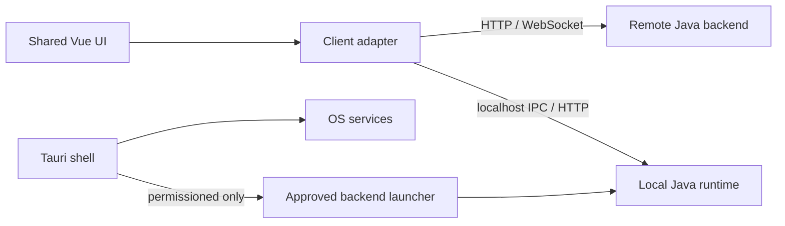

# Desktop frontend specification

## Decision

The frontend is a shared Vue application with two delivery targets:

```text
packages/ui + packages/domain
          ↓
apps/web       browser deployment
apps/desktop   Tauri 2 desktop shell
```

The desktop target is planned around Tauri 2. It supports Windows, macOS, and Linux from the same frontend codebase while keeping operating-system access behind an explicit capability/permission boundary. Tauri supports Vue and other frontend frameworks, and its capability files define the permissions available to each window. [Tauri](https://tauri.app/), [Capabilities](https://tauri.app/security/capabilities/)

## Why Tauri instead of Electron

This is a fit-for-purpose decision, not a claim that Electron is incapable. Tauri is preferred because this product is a thin desktop shell around a Vue UI and a Java runtime, with a strong requirement that filesystem, shell, workspace, and Expert capabilities remain explicit and auditable.

## Migration risk and portability strategy

There is a real migration risk if Tauri becomes part of the application domain. The project must therefore treat Tauri as a replaceable shell, not as the desktop architecture itself.

```text
Shared Vue application
├─ domain / task state / Master UI
├─ API client
├─ desktop platform contract  ← stable boundary
│  ├─ Tauri adapter
│  └─ Electron adapter (future)
└─ web adapter
```

The shared application may depend on a small `DesktopPlatform` interface, for example:

```ts
export interface DesktopPlatform {
  chooseWorkspace(): Promise<string | null>
  showNotification(input: NotificationInput): Promise<void>
  openExternal(url: string): Promise<void>
  getPlatformInfo(): Promise<PlatformInfo>
}
```

Vue components must call this interface or a composable, never `@tauri-apps/*` directly. Tauri permissions, Rust commands, window handles, and sidecar details remain inside `apps/desktop/platform/tauri`. A future Electron implementation can satisfy the same contract through preload and IPC.

### Portability rules

- Keep task, Master, Expert, knowledge-base, rule, and validation logic in Java/backend or shared TypeScript domain code.
- Keep filesystem and process execution behind backend APIs whenever possible.
- Limit desktop-specific APIs to workspace selection, notifications, window controls, secure preferences, and approved sidecar launch.
- Define contract tests that run against Web, Tauri, and the future Electron adapter.
- Do not persist Tauri-specific object shapes in task data or backend APIs.
- Do not make Rust types part of shared frontend packages.

With this boundary, migration is a shell replacement project rather than a rewrite of the frontend. The cost is still non-zero: packaging, auto-update, signing, filesystem permissions, IPC behavior, and platform QA must be reimplemented and verified.

| Decision factor | Tauri 2 | Electron | Project choice |
|---|---|---|---|
| Renderer | OS WebView | Bundled Chromium | Tauri; avoid shipping a second browser runtime |
| Native boundary | Rust core plus capability files | Node.js main process plus IPC | Tauri; narrower default exposure for workspace tools |
| Existing UI | Reuses Vue/Vite | Reuses Vue/Vite | Tie |
| Local Java backend | Permissioned sidecar or local service | Node main process launcher | Tauri; Node is not needed as the product backend |
| Artifact/resource footprint | Generally smaller because WebView is supplied by the OS | Larger because Chromium and Node are bundled | Tauri |
| Rendering consistency | Depends on WebView2/WKWebView/WebKitGTK versions | Consistent Chromium version | Electron advantage for pixel-identical rendering |
| Ecosystem and Node modules | Smaller desktop ecosystem; native work may require Rust/plugin | Mature Node desktop ecosystem | Electron advantage |
| Best fit | Secure, capability-scoped desktop shell | Chromium-first, Node-heavy desktop product | Tauri for this repository |

Tauri's security model separates frontend code from the Rust core and uses capabilities to constrain what the frontend can access. It also relies on the system WebView rather than bundling Chromium. [Tauri security](https://tauri.app/security/), [Tauri architecture](https://tauri.app/concept/architecture/)

Electron remains a valid fallback if the product later requires a fully pinned Chromium runtime, deep Node-native integrations, or an ecosystem package that has no practical Tauri equivalent. Electron embeds Chromium and Node.js, which simplifies Node-heavy integrations but increases the runtime and security boundary that must be maintained. Electron's own documentation emphasizes that Node integration and sandbox configuration require careful security controls. [Electron overview](https://www.electronjs.org/docs/latest/), [Electron sandbox](https://www.electronjs.org/docs/latest/tutorial/sandbox/)

## Desktop versus web

| Concern | Web | Desktop |
|---|---|---|
| UI | Shared Vue routes and components | Same Vue routes and components inside Tauri WebView |
| Runtime | Remote backend API | Local backend connection or bundled local runtime |
| Workspace | User selects a remote/project URL | User selects local workspace directory |
| Git/SVN/Shell | Backend executes them | Backend service or approved Tauri sidecar executes them |
| File access | Upload/API scope | Tauri filesystem permission scoped to selected workspace |
| Notifications | Browser permission | Native desktop notification capability |
| Updates | Web deployment | Signed installer and updater channel |
| Offline mode | Limited | Optional local-first task queue and cached observations |

## Desktop shell boundaries

The Tauri shell may provide only platform services:

- workspace folder selection;
- native window and menu behavior;
- notifications;
- secure storage for non-secret local preferences;
- opening an external URL;
- launching explicitly approved sidecars.

The shell must not contain task planning, Master decisions, Expert authorization, or validation logic. Those remain in the Java backend so web and desktop clients have identical semantics.

## Local runtime options

The first desktop release should use a separately started Java backend connection. A later distribution can bundle a Java runtime and backend launcher as a signed sidecar. Sidecar execution must be explicitly permissioned, argument-scoped, audited, and bounded; Tauri requires sidecar execution permissions in its capabilities configuration. [Tauri sidecars](https://v2.tauri.app/develop/sidecar/)



## Desktop acceptance criteria

- The same task, Master decision, Expert, knowledge-base, and rule screens work on web and desktop.
- A desktop task can select a local workspace without granting unrestricted filesystem access.
- Every OS operation is represented by an explicit shell command or permission and is auditable.
- Closing the window does not lose task state; running tasks are resumed or marked interrupted.
- Windows, macOS, and Linux builds run the same contract and conformance tests.
- No Node REPL, arbitrary JavaScript execution, or unrestricted shell is shipped to the renderer.

## Reconsideration triggers

Re-evaluate Electron only if at least one of these becomes a hard requirement:

- a pinned Chromium feature unavailable or inconsistent in system WebViews;
- a critical Node-native library with no safe backend or Tauri integration;
- desktop functionality becomes primarily a Node application rather than a shell around the Java runtime;
- the cost of maintaining Rust/Tauri plugins exceeds the security and footprint benefits.

## Implementation order

1. Extract shared UI and typed API/domain packages.
2. Add `apps/desktop` Tauri 2 shell with a read-only Overview and Task detail screen.
3. Add workspace picker and backend connection settings.
4. Add permission-scoped local runtime/sidecar integration.
5. Add native notifications, update channels, signing, and platform CI builds.
