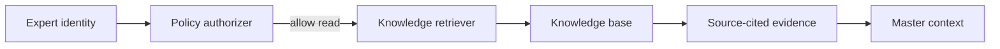
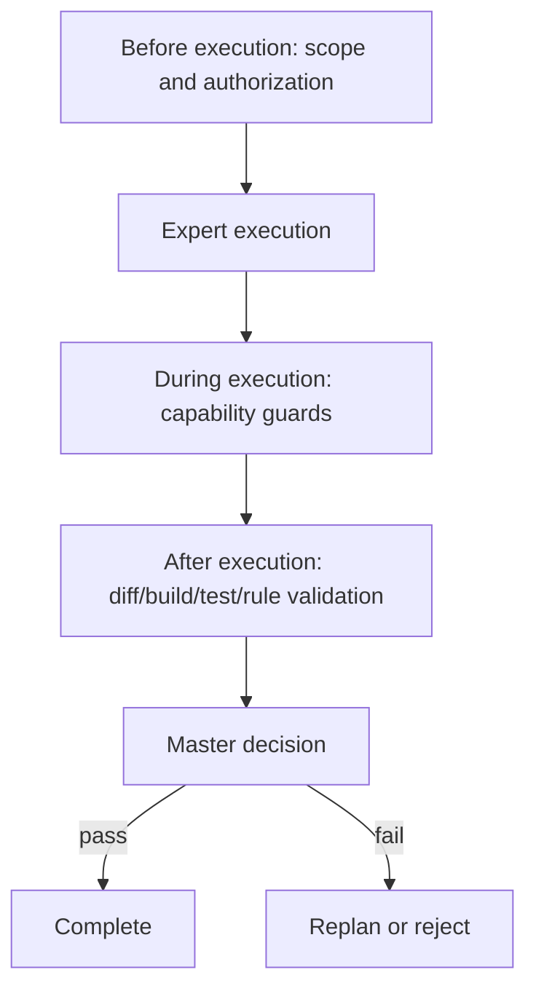

# Experts, knowledge bases, and rules

## 1. Custom experts

An expert is a declarative, versioned role definition. It is similar in spirit to `AGENTS.md`, but is scoped, discoverable, and enforceable by the runtime.

Recommended repository layout:

```text
.eap/
├─ experts/
│  ├─ backend-java.yaml
│  ├─ frontend-vue.yaml
│  └─ reviewer.yaml
├─ knowledge/
│  ├─ architecture/
│  └─ standards/
└─ rules/
   ├─ security.yaml
   └─ testing.yaml
```

Example expert:

```yaml
apiVersion: eap/v1
kind: Expert
metadata:
  name: backend-java
spec:
  description: Java backend implementation specialist
  capabilities: [git-status, git-diff, rg-search, maven-test]
  knowledgeBases: [architecture, java-standards]
  rules: [secure-process-execution, tests-required]
  canModify: [backend/**]
  canApprove: false
```

The runtime loads experts through an `ExpertRegistry`. Repository definitions are untrusted input: they must be schema-validated, permission-checked, and shown in the UI before execution. `AGENTS.md` remains human-readable supplementary guidance; an Expert Manifest is the machine-enforced policy boundary. If the two disagree, the structured manifest, platform policy, and explicit user authorization win; `AGENTS.md` cannot grant permissions.

### Expert authoring flow


The frontend should provide schema-backed forms and a read-only YAML/JSON preview. The backend remains the authority for validation and authorization; the frontend must not decide whether a capability or knowledge base is permitted.

## 2. Knowledge bases and authorization

A knowledge base is a versioned collection of documents or indexed facts with an explicit source, owner, visibility, and retrieval policy. It should support repository-local documents first, then optional external indexes later.



Authorization is deny-by-default. An expert can use a knowledge base only when its definition references the KB and the task policy grants the corresponding scope. Retrieval must return source references, document versions, and excerpts so the Master can distinguish evidence from an unsupported claim.

Minimum knowledge-base metadata:

```yaml
name: java-standards
version: 1
owner: platform-team
visibility: repository
sources:
  - path: docs/java/
    glob: '**/*.md'
```

Knowledge-base ingestion should treat object storage versions as immutable evidence. The PostgreSQL record must retain the RustFS bucket, object key, object version ID, checksum, parser version, and embedding model/version used to create each chunk.

## 3. Rules and enforcement

Rules are executable acceptance criteria, not prompt text. They are evaluated at multiple points:



Example rule:

```yaml
apiVersion: eap/v1
kind: Rule
metadata:
  name: tests-required
spec:
  severity: blocking
  appliesTo: [backend/**]
  checks:
    - type: command
      command: [mvn, test]
    - type: changed-path
      deny: ['**/.env*']
```

Experts do not self-certify rule compliance. The platform records `RuleEvaluation` objects with rule version, inputs, evidence, result, and evaluator identity. Blocking failures prevent `completed`; the Master must surface the failed rule and choose replan, user input, or escalation.

## 4. Node REPL and controlled Expert DSL

Using `node-repl` is reasonable when it means a controlled TypeScript/Node authoring DSL. Typed definitions are composable and testable, and reduce ambiguity compared with free-form `AGENTS.md` text. The boundary should be:

```text
@eap/expert-sdk authoring package
  -> declarative Expert Manifest
  -> schema and policy validation
  -> ExpertRegistry / Master
  -> allowlisted Capability execution
```

The REPL or CLI may expose `expert validate`, `expert preview`, and `expert test`, but it must run outside the browser and expose only an allowlisted SDK. It must not expose arbitrary `child_process`, filesystem, network, environment, or dynamic package-loading APIs.

Therefore, `node-repl` can be a development dependency of Expert SDK/tooling, but not a runtime dependency of the Vue application and not the authority for permissions. The frontend should invoke a backend or CLI preview API and render its result; it should never execute the DSL locally.

`AGENTS.md` also should not be the only definition mechanism. It is intentionally free-form and can be ambiguous, stale, or overly broad. Use it for repository context and conventions, while requiring a versioned, schema-validated Expert Manifest for capabilities, knowledge access, rules, scope, and approval rights.

If interactive evaluation is later needed, expose a backend `SandboxExecutionCapability` with:

- an isolated working directory;
- an allowlisted command/runtime;
- CPU, memory, time, and output limits;
- no ambient secrets or unrestricted network;
- an `Observation` and audit record for every execution.

The frontend only renders the execution request and result through the normal Task API. If an expert needs a REPL-like execution capability, declare a backend capability such as `sandbox-node`, authorize it explicitly in the Expert Manifest, and validate its output like every other observation. Defining an Expert and executing a task are separate permissions.

## 5. Optional decision models

Jev-like decision models can accelerate Expert routing and Master triage. They should receive typed candidates and return a constrained choice, score, confidence, or `needs-review` result. They should not generate capability arguments, grant permissions, approve rule violations, or replace the final Validator. Keep the integration behind `DecisionProvider` so a local deterministic scorer, Jev, or another provider can be selected by policy.
