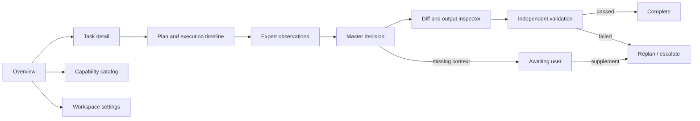

# Frontend prototype

## Product shell

The first frontend prototype is a cross-platform workspace console. It keeps the current workspace and task state visible while allowing the user to inspect observations, diffs, validation results, and escalation decisions.

The UI is a shared Vue application with both a browser target and a Tauri 2 desktop target. Desktop-only behavior belongs to a typed client adapter and is never embedded directly into shared views.

```text
┌─────────────────────────────────────────────────────────────────────────────┐
│ EAP  [Workspace: engineering-automation-platform ▼]       [Run] [Settings] │
├───────────────┬───────────────────────────────────────┬─────────────────────┤
│ WORKSPACE     │ TASK / RUN                            │ INSPECTOR           │
│               │                                       │                     │
│ ⌂ Overview    │ Goal                                  │ Selected item       │
│ ◇ Capabilities│ Implement capability...                │                     │
│ ▣ Tasks       │                                       │ Observation         │
│ ✓ Validation  │ Plan                                  │ status: success     │
│               │ 1. Detect repository                  │ command / output    │
│               │ 2. Read status                        │                     │
│               │ 3. Validate diff                      │ Diff                │
│               │                                       │ files changed       │
│               │ Timeline                              │                     │
│               │ [expert] [master] [validated]         │ Master decision     │
│               │ [Add context] [Replan]               │ Validation          │
├───────────────┴───────────────────────────────────────┴─────────────────────┤
│ Status: Ready   Workspace: clean   Last validation: passed                    │
└─────────────────────────────────────────────────────────────────────────────┘
```

## Core screens



## Interaction rules

- A task always shows its current state: planned, running, expert-review, validating, awaiting-user, completed, failed, or escalated.
- The Master decision is visible separately from expert output: accepted, rejected, conflicting, awaiting-user, or needs-revalidation.
- External agent output is displayed as an observation and never as a completion assertion.
- Users can add context, constraints, corrections, or attachments after submission. Supplements are appended and create a new plan revision without erasing prior evidence.
- Expert, knowledge-base, and rule permissions are visible before a run starts; the UI must not imply that an expert can read or modify ungranted resources.
- Custom experts are edited through a schema-backed form with a YAML/JSON preview and backend validation result; the browser never executes the expert definition.
- The primary action is `Run` or `Validate`; destructive operations require an explicit confirmation and a visible scope.
- The inspector is read-only by default and shows command, arguments, exit code, stdout, stderr, diff scope, and validation evidence.
- Desktop layout uses the three-column shell; narrow screens collapse the inspector below the task timeline and preserve the same navigation order.

## First implementation slices

1. Static shell and route model: Overview, Task detail, Capability catalog.
2. Mock observation timeline using typed fixtures.
3. Backend API client with typed request/response models.
4. Live task state and validation evidence.
5. Master decision panel, supplement composer, and replan flow.
6. Diff viewer and escalation flow.
7. Expert editor, knowledge-base permissions, and rule evaluation panels.
8. Desktop shell, local workspace picker, backend connection settings, and native notification states.
