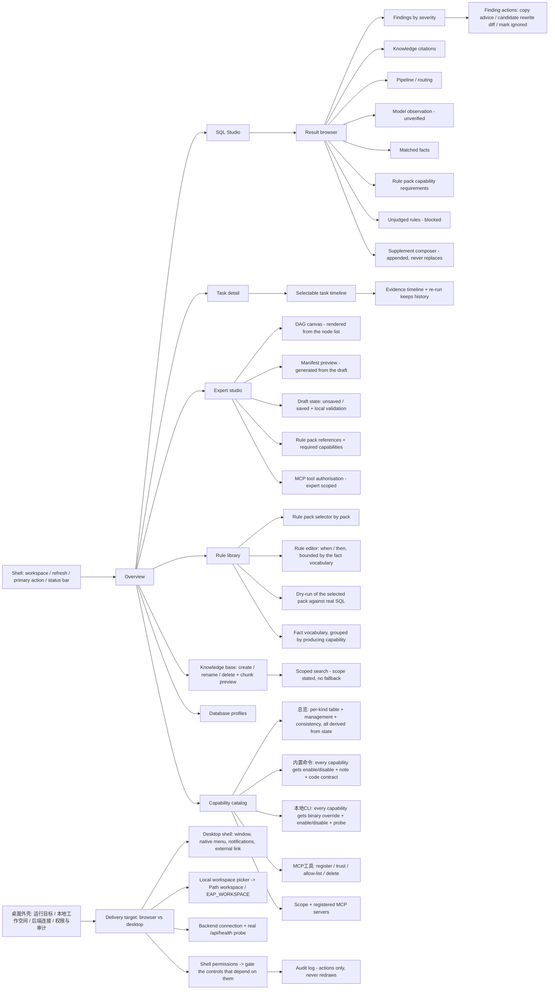

# Frontend prototype

## What was wrong with the first screen

The first frontend was a debug panel, not a product. It had:

- a hash-routed page that dumped expert manifests as raw JSON in a `<textarea>`;
- forms stacked with `<details>` and checkbox grids, with no visual hierarchy;
- no results browser: findings, knowledge citations and model output were rendered as a flat list;
- no way to see *why* the runtime did or did not call a model.

A prototype that fixes the information architecture is committed at
`docs/prototype/console.html` (self-contained, open directly in a browser). It is also the reference
for *interaction* behaviour: every control on it either changes visible state or explains why it
cannot. The Vue app is aligned to it.

## Product shell

A three-column console. The workspace and runtime state stay visible; the inspector explains the
currently selected item, and is **page-scoped**: on every page switch it resets to that page's own
description instead of keeping the previous page's selection.

The shell is state too, not decoration — the workspace dropdown, 刷新, 运行分析 and the status bar all
read the same snapshot the pages read, so the header can never disagree with the body.

```text
┌───────────────────────────────────────────────────────────────────────────────────┐
│ EAP   工作空间 [engineering-automation-platform ▾]  ● 已连接 [浏览器] [刷新] [运行分析]│
├──────────────┬──────────────────────────────────────────────┬─────────────────────┤
│ 工作空间      │ 工作台                                        │ 检查器 · 当前页     │
│              │                                              │                     │
│ ⌂ 概览        │ 每页内容全部由状态渲染；控件要么改变可见状态，  │ 已选中：发现 / 任务 │
│ ▤ 任务        │ 要么说明它为什么不能：                         │ 或：本页说明        │
│ ▷ SQL 分析室  │   · 概览      指标卡 + 最近任务（行可点）      │ （本页无对象时）    │
│ ◈ 专家工作室  │   · 任务      列表 | 时间线 | 证据 | 重新运行  │ severity: high      │
│ ▢ 知识库      │   · SQL 分析室 输入 | 结果浏览 | 流水线       │ evidence: …         │
│ ▤ 规则库      │   · 专家工作室 列表 | DAG | 草稿编辑          │ suggestion: …       │
│ ▦ 数据库资料  │   · 规则库    规则包 | 规则 | 试算            │                     │
│ ⚙ 能力目录    │   · 知识库    知识库 | 文档 | 检索            │ 当前任务的流水线    │
│              │   · 数据库资料 资料表 | 新增 / 编辑 / 删除    │ deterministic ✓     │
│ 运行环境      │   · 能力目录  页签由种类声明生成：             │ decision: skip      │
│ ▣ 桌面外壳    │               总览 | 内置命令 | 本地CLI        │ model: not called   │
│              │               | MCP工具（HTTP 无页签）        │                     │
│              │   · 桌面外壳  窗口与菜单 | 本地工作空间 |      │                     │
│              │               后端连接 | 系统权限与审计       │                     │
├──────────────┴──────────────────────────────────────────────┴─────────────────────┤
│ 就绪  运行目标: 浏览器  工作空间: engineering-automation-platform  本地目录: 未选择  │
└───────────────────────────────────────────────────────────────────────────────────┘
```

The rail has **one entry per page**; a page's sub-pages are tabs inside it, not rail entries. 能力目录
and 桌面外壳 both work that way, and the 能力目录 tabs are generated from the runtime's kind declaration
(see below) rather than written into the markup — so a kind that becomes manageable or non-empty appears
on its own, and HTTP, which is neither, has no tab.

Choosing 桌面端 on the 桌面外壳 page wraps this same shell in a window frame with a native menu
(文件 / 视图 / 帮助) and enables the platform services that only the shell can provide; the controls that
cannot work in a browser stay in place, disabled, with the reason printed beside them.

## Core screens



## Interaction rules

- **The pipeline is first-class.** Every SQL result shows the route explicitly:
  `deterministic → decision (enhance/skip + rationale) → model (called / not called)`, with the
  measured `compressionRatio` when a model was used. This is what makes cost reduction visible.
- **Findings are structured.** Each finding shows a severity chip, its category, the observed
  evidence and a semantics-preserving suggestion. No raw JSON in the primary view.
- **Findings are explainable.** Because a finding comes from a rule pack, the result browser can show
  the **matched facts** behind it and the pack that produced it (`rulePacks` in the response). "Why
  did it say that" must always have an answer that is not "it's in the code".
- **Capabilities are grouped by kind, not listed flat.** The catalog renders the runtime's own
  declaration as sub-pages: **总览 / 内置命令 / 本地 CLI / MCP 工具** — tabs inside the page, not extra
  rail entries. The tab list itself is built from each kind's declared management entry point plus whether
  it currently has any capability, so HTTP (nothing to manage yet) gets no tab while MCP gets one even
  while empty — because that page *is* the entry point that makes it non-empty. The tabs genuinely switch
  content — exactly one sub-page is rendered at a time, never four stacked sections — and a sub-page with
  no entries says why it is still there instead of drawing an empty shell. Selecting a capability (its card
  header or its row in the full table) drives the inspector, which is what makes the catalogue actionable
  rather than decorative.
  Each capability shows its title, what it must be given, what it
  must be authorised for, what actually executes it, the facts it publishes, the evidence it contributes
  and whether it is runnable right now (a CLI with a missing binary shows `缺少可执行文件`, a capability
  switched off shows `已停用`). A declaration-consistency panel surfaces declared-but-unregistered and
  undeclared-but-registered capabilities rather than hiding them. The console never invents a kind or
  a capability description — both come from `/api/capabilities`.
  **Nothing on this page is markup-derived.** The kind table, per-kind counts and state chips, the
  per-capability cards, the full capability table and the inspector all read one capability list and one
  kind declaration, so a single switch-off cannot leave "可用 5" in one place and "已停用" in another. The
  same rule decides what the expert editor may offer: the platform node picker excludes capabilities the
  operator switched off and lists them separately with the reason (`disabledPlatform`), instead of letting
  an operator wire a node the runtime refuses to resolve.
- **Each kind of capability has a management surface, and it is honest about its limits.** Every
  capability of a manageable kind gets a card — no subset: 内置命令 renders all five, 本地 CLI all three.
  Both offer enable/disable plus a note, and 内置命令 states that a new capability needs a handler bean and
  a declaration — the console shows 新增能力一律需要改代码 instead of a button that cannot work. 本地 CLI
  adds a binary override (shown with its resolved path and a `shipped` / `operator` source chip), a reset,
  and an explicit 探测 action that runs `<binary> --version` once; nothing is executed while the page
  renders. MCP 工具 offers full server management: registration form, per-server enable/trust/probe/edit/
  delete, and the list of capabilities each server publishes. A disabled capability is rendered as
  `已停用`, never as `缺少可执行文件` / `未接入` — "switched off" is a decision, "broken" is a defect, and
  switching one off that an *enabled* expert runs is refused by name.
- **Capability requirements are visible at every level.** A rule pack shows 需要能力 (its
  `requires.capabilities`); the expert studio shows 所需能力 derived from the packs it references and
  warns when the graph has no node that can produce those facts; the SQL result shows a
  `规则包能力需求` block (required / met / missing) plus a `未判定的规则` list naming the missing facts and
  capabilities. The console never presents "no findings" as equivalent to "checked and clean".
- **Capability scope is visible, not implied.** The console shows `平台级` / `专家级` on every
  capability and on each kind, an MCP server block (registered, enabled, trusted, allow-listed tools),
  and `globallyRunnable` as reported by the runtime. An MCP tool is listed as an expert-scoped
  capability with "不会全局启用" and its authorised experts, never next to `sql.parse` as if every
  expert could run it. The expert editor has an MCP authorisation block: a declared tool becomes a
  selectable node, an undeclared one is a blocking error, and the flat capability picker stays
  platform-only. Capabilities the operator switched off are excluded from that picker and listed
  separately, so the omission is explainable instead of silent. These rules live in `capabilityScope.ts`
  and are unit tested.
- **Rules are first-class content.** The rule library lists every pack (shipped packs marked
  read-only), shows each rule's condition and advice, and offers a dry-run that reports the matched
  facts, the findings, the severity counts and the summary for a given SQL — the same computation the
  runtime performs, with nothing saved. Authoring a rule never requires a code change and never
  executes SQL. The fact vocabulary is grouped by producing capability, so it is obvious which
  capability a rule depends on before publishing it.
- **Selecting a rule pack drives its detail panel.** The pack list is the selector; the panel renders
  *that* pack's rules — condition, escalation, evidence, advice, and the capability that produces each
  fact. A shipped pack (`builtin`) is read-only and every edit affordance on it is refused with the
  actual remedy (复制为自定义), because editing it in place would be silently overwritten by the next
  upgrade. A custom pack gets inline rule editing (severity / evidence / advice) plus add and remove,
  and the revision counter increments on every save — the visible proof that rules are data.
  Authoring stays bounded by the fact vocabulary: a rule naming an undeclared fact is refused, and the
  producing capability is folded into `requires` automatically, because a rule referencing an unknown
  fact would never fire and would look exactly like "nothing wrong". Deleting or disabling a pack is
  refused while an enabled expert still references it, naming the experts. The dry-run runs against the
  pack you have selected, so what is tried is what is being edited.
- **Knowledge is a container you can manage, and search is scoped.** Knowledge bases and documents are
  created, renamed and deleted from the page; a new document is written into the selected base and a
  preview shows the chunks that will be indexed. Search states its own scope — the union of the enabled
  experts' granted bases — and an ungranted base contributes **zero** results rather than falling back
  to everything, because deny-by-default has to be visible, not merely implemented. A query with no
  match explains its scope instead of showing a blank list, and a document that looks like it contains a
  credential is refused with the reason.
- **An analysis is a run with states, and re-running preserves history.** 运行分析 disables the button,
  marks the run `执行中` and appends a task; when it settles the run is either `已完成` or `部分完成`,
  and `部分完成` is used exactly when model review was requested but the deterministic stage alone could
  not decide. The previous run is never overwritten: 重新运行 adds a new row and the timeline switches
  to it, so "what changed since" stays answerable. A run that could not be judged lists its unjudged
  rules and the missing facts instead of reporting success.
- **A finding has three actions, and none of them mutate the input.** 复制建议 puts the
  semantics-preserving suggestion on the clipboard; 查看候选改写 renders a before/after diff that says
  in the panel that it 不会自动执行、也不会替换你的输入; 标记忽略 records the operator's judgement on
  that finding only, and the finding stays visible (marked, not removed) so the review trail survives.
  Ignoring a finding never edits the rule pack, and no candidate rewrite is ever executed.
- **Expert editing is draft-based, and the manifest is generated from the draft.** Editing mutates a
  deep copy; the header shows 有未保存的修改 / 已保存 and 保存草稿 is the only way to commit. The
  manifest preview is produced from that draft rather than from a fixed sample, so it cannot advertise
  something the editor does not contain, and the DAG canvas renders from the same node list, so adding
  or removing a node moves the graph immediately. 校验 applies the backend's own rules locally — id
  shape (`^[a-z0-9][a-z0-9_-]{0,60}$`), non-empty name, at least one node, no duplicate capability, no
  node using an expert-scoped capability that was never authorised, no dangling knowledge / profile /
  rule-pack reference, no disabled rule pack, and no rule pack whose `requires` capability has no node
  — so 校验 and the server can only disagree if the server is wrong. The rule pack picker is populated
  from `/api/experts/catalog`, so an expert can only reference packs that resolve. A built-in expert
  cannot be deleted (the control is disabled and 复制为自定义 is offered) and an enabled expert must be
  stopped before deletion. Validation and authorisation stay in the backend: the browser never executes
  an expert definition.
- **The inspector is an evidence panel, not a form.** It shows the selected item's command, arguments,
  exit code, stdout/stderr, diff scope and validation evidence where applicable — and for a finding,
  its severity, the matched facts behind it and the pack that produced it.
- **Permissions are visible before a run.** Knowledge-base and database grants are shown as explicit
  removable chips, with deny-by-default semantics. Anything the runtime cannot hold is refused at the
  field with the reason — a connection password in a database profile, a secret in a CLI path or an MCP
  endpoint, a credential pasted into a knowledge document or a supplement — and the page never displays
  a credential that was not stored. The refusal is not cosmetic: the runtime rejects these same fields
  server-side (`SensitiveData.containsSecret`, which also refuses a binary path, an MCP address, a
  knowledge document and an execution plan that contain a credential) and redacts stdout/stderr and
  model text on the way out.
- **No control is decorative.** Every button, row and chip either changes visible state or states why
  it cannot, and where a real endpoint exists it is named: `POST /api/mcp-servers` to register a
  server, `DELETE /api/databases/{id}`, `POST /api/rule-packs/dry-run`, `POST /api/experts/{id}/execute`.
  Interactions that live only in the prototype say so instead of implying a backend. The top-bar workspace
  switcher is client-side — tasks are not scoped by workspace on the server — and says so when it is used,
  pointing at 桌面外壳 → 本地工作空间 for the directory that actually decides where the local CLI
  capabilities run; 重新运行 and 补充上下文 both name `POST /api/experts/{id}/execute` as what a real console
  would call, and the supplement composer states outright that the runtime has no supplement resource
  today, so a supplement is a new execution rather than an in-place rewrite of history. The inverse is
  enforced too — no button is offered for something the runtime cannot do, so 新增能力一律需要改代码 is
  stated on 内置命令 and the LLM settings are a read-only table rather than a form that could never
  submit. The one place the prototype *adds* capability, the desktop shell, is gated by a declared
  permission and the gate is printed next to the control.
- **Model output is separated.** Model text is always rendered under an "unverified observation"
  heading and never merged into the deterministic findings.
- **Primary action is one button** (`Run` / `运行分析`); it is the same action as the SQL studio's, so
  there is no second, differently-behaving entry point. Destructive actions require confirmation and a
  visible scope.
- **The inspector is page-scoped, not a permanently empty panel.** It is labelled with the current
  page name, and on every page switch it resets to that page's own description — it never keeps the
  previous page's selection. Only pages that actually produce per-item results (SQL findings today)
  render a selection card; on the others the panel states plainly what can be inspected and where that
  detail is shown instead of leaving a stale or generic prompt. The pipeline block appears only where
  it means something (概览 / 任务 / SQL 分析室); the platform-wide safety note is explicitly labelled
  全局说明（与页面无关） so it is not mistaken for page state.
- **Narrow screens** collapse the inspector below the workbench and keep the same navigation order.
- **The delivery target is state, and the shell is not the product.** 浏览器 and 桌面端 are two targets
  of one UI, so the shell page can switch between them: switching draws the window frame and the native
  menu, and switching back does **not** hide the desktop-only controls — it disables them and writes the
  reason next to them (浏览器读不到本机目录 / 没有窗口生命周期 / 不能持久化偏好). Nothing in the shell plans
  tasks, decides, authorises an expert or validates anything; the menu carries only platform services
  (选目录 / 窗口 / 通知 / 打开外部链接 / 审计), and the console asserts that explicitly.
- **A local workspace is not the top-bar workspace.** The picker chooses a directory on disk, which is
  the backend process's execution directory (`Path workspace` ← `EAP_WORKSPACE`, otherwise the process
  start directory, or its parent when the start directory has no `.git`). The runtime exposes no way to
  change it while running, so the console writes it into the launch configuration and says 需要重启后端才生效
  instead of pretending the switch applied. The top-bar switcher stays a client-side view filter, and the
  two are deliberately not one control — merging them would imply a dropdown decides where `git` runs. A
  missing directory is refused rather than silently falling back to the previous one, because that failure
  surfaces much later, in the wrong place.
- **The connection is probed, not faked, and configuration stays read-only.** 测试连接 issues a real
  `GET /api/health` and reports the status and latency it actually got — including a truthful failure, and
  a truthful "this environment has no `fetch`" when it cannot probe at all. A credential in the address is
  refused by parsing the URL's userinfo, not by pattern-matching the string. The LLM budget is a read-only
  table of the `eap.llm.*` environment variables, because the runtime has no config-write endpoint: a form
  there could never submit, so it is not drawn.
- **Revoking a shell permission disables what depends on it.** The permission table is the source of truth
  for the desktop-only controls, so revoking `dialog:allow-open` really disables 浏览本地目录 and names that
  capability in the reason; granting it back re-enables the control. Every shell action is appended to an
  audit log — and switching a sub-tab appends nothing, because the log records actions, not redraws.
- **Closing the window is a state transition, not a shutdown.** Closing while a run is in flight marks it
  `已中断` — visible, filterable, evidence preserved, re-runnable — and the settle timer is not allowed to
  overwrite that with `已完成`.

## Implementation slices

Two tracks, because the prototype is deliberately ahead of the app. `原型` = the interactive prototype
(`docs/prototype/console.html`), `应用` = the Vue app (`frontend/apps/web`). A slice is only ✅ on a
track when that track really behaves that way; interactions the prototype demonstrates but the app has
not adopted yet are marked on the 原型 track alone.

1. ✅ 应用 · ✅ 原型 — Shell and route model: Overview, Tasks, SQL Studio, Experts, Knowledge, Rules,
   Databases, Capabilities, with a **page-scoped inspector** that resets on every route change and
   reports the current page by name.
2. ✅ 应用 · ✅ 原型 — Typed API client aligned to the runtime response (`modelAdvisor`, structured
   findings).
3. ✅ 应用 · ✅ 原型 — SQL Studio with a real results browser and the pipeline/routing block.
4. ✅ 应用 · ✅ 原型 — Rule library: pack catalog, rule list with conditions and advice, dry-run, fact
   vocabulary grouped by producing capability, per-pack capability requirements.
5. ✅ 应用 · ✅ 原型 — Capability catalog as **interactive** sub-pages (总览 / 内置命令 / 本地 CLI /
   MCP 工具), where the sub-pages, per-kind counts and per-capability cards are **derived from the kind
   declaration and the capability list** rather than written into the markup, so a switch-off updates the
   tab, the kind row, the full table, the card and the inspector together. Per-kind management surfaces —
   enable/disable + note for every built-in command *and* every CLI capability, CLI binary override +
   reset + probe, MCP server registration/trust/allow-list/delete — plus per-capability metadata,
   availability, scope and declaration-consistency reporting in both directions (declared-but-unregistered
   and registered-but-undeclared, plus MCP published-but-undeclared and declared-but-unpublished). The
   expert studio shows the capabilities its rule packs require, the MCP tools the expert is authorised to
   call, and excludes the platform-disabled capabilities from the node picker while listing them with the
   reason.
6. ✅ 应用 · ✅ 原型 — Live task state and evidence timeline: a run has an explicit state, the timeline
   is driven by the selected task, and re-running appends a row instead of overwriting one.
7. ⬜ 应用 · ✅ 原型 — Rule editor: select a pack, edit a rule inline (severity / evidence / advice),
   add and remove rules, refuse edits on a shipped pack with the 复制为自定义 remedy, and try the rule
   pack being edited. The app still only lists and dry-runs.
8. ⬜ 应用 · ✅ 原型 — Expert editor with a **generated** manifest preview, draft state (有未保存的修改),
   knowledge / profile / rule-pack chips, MCP tool authorisation picker, a DAG canvas rendered from the
   node list, and 校验 that mirrors the backend's own checks.
9. ⬜ 应用 · ✅ 原型 — Decision panel, unjudged-rule list and supplement composer: the skipped decision
   is clickable and explains why, an undecided run names the missing facts, and a supplement is
   appended without erasing prior evidence.
10. ⬜ 应用 · ✅ 原型 — Finding actions and diff viewer: 复制建议, 查看候选改写 (before/after diff that
    is never auto-executed and never replaces the input), 标记忽略 (records judgement without hiding
    the finding or editing the pack).
11. ✅ 应用 · ✅ 原型 — MCP server registration UI (transport, allow-listed tools, trust). The backend
    registry is writable through `/api/mcp-servers`; the probe reports `verified: false` until an MCP
    client exists.
12. ✅ 应用 · ✅ 原型 — Knowledge container management (create / rename / delete a base, add a document,
    preview the chunks) and scoped search whose scope is stated on the page.
13. ⬜ 应用 · ✅ 原型 — 刷新 / 工作空间 / status bar as real state, with the top-bar workspace switcher
    labelled client-side because tasks are not scoped by workspace on the server.
14. ⬜ 应用 · ✅ 原型 — **桌面外壳**: a delivery-target switch (浏览器 / 桌面端 · Tauri 2) that draws the
    window frame and native menu, with desktop-only controls disabled *and explained* in browser mode;
    window/menu/notification/external-link services; the **local workspace picker** (recent list, a
    missing directory handled honestly, the Tauri filesystem scope, and the distinction from the
    top-bar workspace); **backend connection** settings (remote / local runtime / packaged sidecar,
    address validation, a real `GET /api/health` probe, non-secret preferences, and the LLM budget as a
    read-only table); and **shell permissions + audit** (revoking a capability really disables the
    control that depends on it, and every OS action is appended to an audit log). Desktop-only
    interactions that need no endpoint say so; the ones that map to the runtime name the call they
    would make. See `docs/desktop-spec.md` for the contract this is modelled on.
